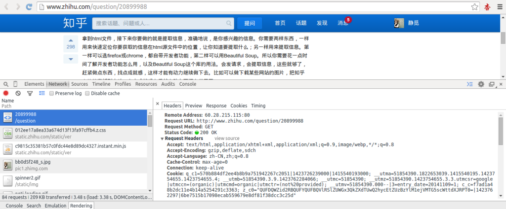

# Urllib 库的高级用法   
  
## 设置 Headers

有些网站不会同意程序直接用上面的方式进行访问，如果识别有问题，那么站点根本不会响应，所以为了完全模拟浏览器的工作，我们需要设置一些 Headers 的属性。

首先，打开我们的浏览器，调试浏览器 F12，我用的是 Chrome，打开网络监听，示意如下，比如知乎，点登录之后，我们会发现登陆之后界面都变化了，出现一个新的界面，实质上这个页面包含了许许多多的内容，这些内容也不是一次性就加载完成的，实质上是执行了好多次请求，一般是首先请求HTML文件，然后加载 JS，CSS 等等，经过多次请求之后，网页的骨架和肌肉全了，整个网页的效果也就出来了。
   
  

拆分这些请求，我们只看一第一个请求，你可以看到，有个 Request URL，还有 headers，下面便是 response，图片显示得不全，小伙伴们可以亲身实验一下。那么这个头中包含了许许多多是信息，有文件编码啦，压缩方式啦，请求的 agent 啦等等。

其中，agent 就是请求的身份，如果没有写入请求身份，那么服务器不一定会响应，所以可以在headers中设置agent,例如下面的例子，这个例子只是说明了怎样设置的 headers，小伙伴们看一下设置格式就好。

```
import urllib  
import urllib2  
url = 'http://www.server.com/login'
user_agent = 'Mozilla/4.0 (compatible; MSIE 5.5; Windows NT)'  
values = {'username' : 'cqc',  'password' : 'XXXX' }  
headers = { 'User-Agent' : user_agent }  
data = urllib.urlencode(values)  
request = urllib2.Request(url, data, headers)  
response = urllib2.urlopen(request)  
page = response.read()   
```  

这样，我们设置了一个 headers，在构建 request 时传入，在请求时，就加入了 headers 传送，服务器若识别了是浏览器发来的请求，就会得到响应。

另外，我们还有**对付”反盗链”**的方式，对付防盗链，服务器会识别 headers 中的 referer 是不是它自己，如果不是，有的服务器不会响应，所以我们还可以在 headers 中加入 referer

例如我们可以构建下面的headers

```
headers = { 'User-Agent' : 'Mozilla/4.0 (compatible; MSIE 5.5; Windows NT)'  ,
                        'Referer':'http://www.zhihu.com/articles' }    
```  

同上面的方法，在传送请求时把 headers 传入 Request 参数里，这样就能应付防盗链了。

另外 headers 的一些属性，下面的需要特别注意一下：

>User-Agent : 有些服务器或 Proxy 会通过该值来判断是否是浏览器发出的请求
Content-Type : 在使用 REST 接口时，服务器会检查该值，用来确定 HTTP Body 中的内容该怎样解析。
application/xml ： 在 XML RPC，如 RESTful/SOAP 调用时使用
application/json ： 在 JSON RPC 调用时使用
application/x-www-form-urlencoded ： 浏览器提交 Web 表单时使用
在使用服务器提供的 RESTful 或 SOAP 服务时， Content-Type 设置错误会导致服务器拒绝服务  

其他的有必要的可以审查浏览器的 headers 内容，在构建时写入同样的数据即可。

## Proxy（代理）的设置

urllib2 默认会使用**环境变量** http_proxy 来设置 HTTP Proxy。假如一个网站它会**检测**某一段时间某个IP 的访问次数，如果访问次数过多，它会禁止你的访问。所以你可以设置一些**代理服务器**来帮助你做工作，每隔一段时间换一个代理，网站君都不知道是谁在捣鬼了，这酸爽！

下面一段代码说明了**代理**的设置用法

```
import urllib2
enable_proxy = True
proxy_handler = urllib2.ProxyHandler({"http" : 'http://some-proxy.com:8080'})
null_proxy_handler = urllib2.ProxyHandler({})
if enable_proxy:
    opener = urllib2.build_opener(proxy_handler)
else:
    opener = urllib2.build_opener(null_proxy_handler)
urllib2.install_opener(opener)  
```  

## Timeout 设置

上一节已经说过 urlopen 方法了，第三个参数就是 timeout 的设置，可以设置等待多久超时，为了解决一些网站实在响应过慢而造成的影响。

例如下面的代码,如果第二个参数 data 为空那么要特别指定是 timeout 是多少，写明形参，如果data已经传入，则不必**声明**。

```
import urllib2
response = urllib2.urlopen('http://www.baidu.com', timeout=10)
```  

```
import urllib2
response = urllib2.urlopen('http://www.baidu.com',data, 10)  
```  

## 使用 HTTP 的 PUT 和 DELETE 方法

http 协议有六种请求方法，get,**head**,put,delete,post,options，我们有时候需要用到 PUT 方式或者 DELETE 方式请求。

>PUT：这个方法比较少见。HTML 表单也不支持这个。本质上来讲， PUT 和 POST 极为相似，都是向服务器发送数据，但它们之间有一个重要区别，PUT 通常指定了资源的存放位置，而 POST 则没有，POST 的数据存放位置由服务器自己决定。
DELETE：删除某一个资源。基本上这个也很少见，不过还是有一些地方比如amazon的S3云服务里面就用的这个方法来删除资源。
如果要使用 HTTP PUT 和 DELETE ，只能使用比较低层的 httplib 库。虽然如此，我们还是能通过下面的方式，使 urllib2 能够发出 PUT 或DELETE 的请求，不过用的次数的确是少，在这里提一下。

```
import urllib2
request = urllib2.Request(uri, data=data)
request.get_method = lambda: 'PUT' # or 'DELETE'
response = urllib2.urlopen(request)  
```  

## 使用 DebugLog

可以通过下面的方法把 Debug Log 打开，这样收发包的内容就会在屏幕上打印出来，方便调试，这个也不太常用，仅提一下

```
import urllib2
httpHandler = urllib2.HTTPHandler(debuglevel=1)
httpsHandler = urllib2.HTTPSHandler(debuglevel=1)
opener = urllib2.build_opener(httpHandler, httpsHandler)
urllib2.install_opener(opener)
response = urllib2.urlopen('http://www.baidu.com')  
```  

以上便是一部分高级特性，前三个是重要内容，在后面，还有 cookies 的设置还有异常的处理，小伙伴们加油！