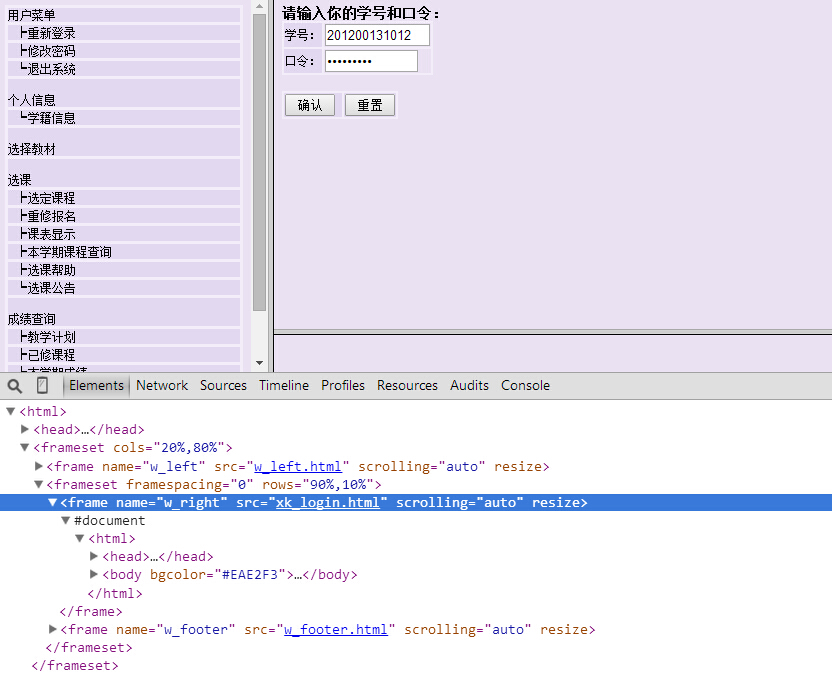
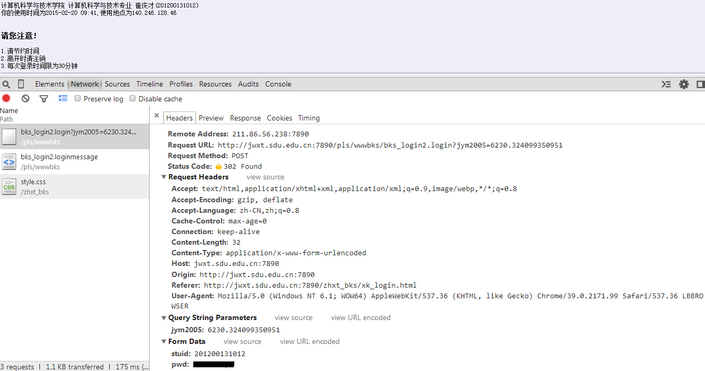
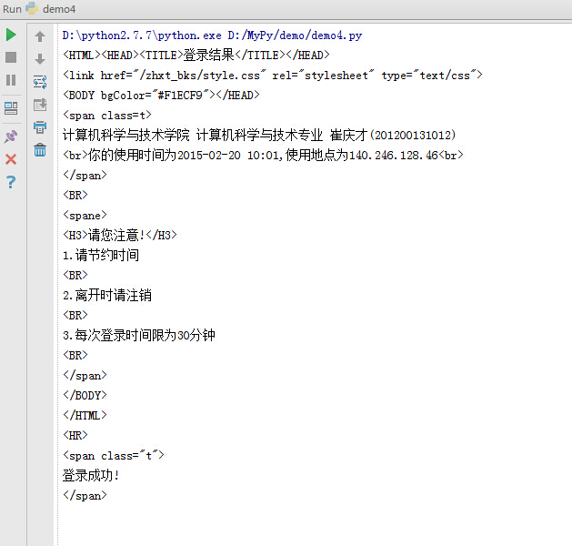
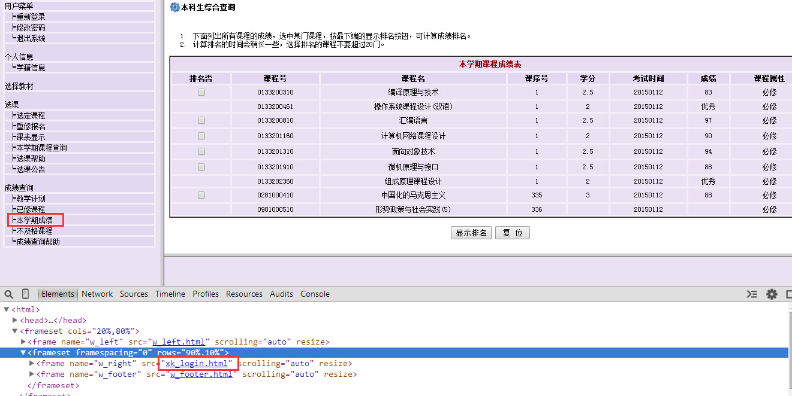
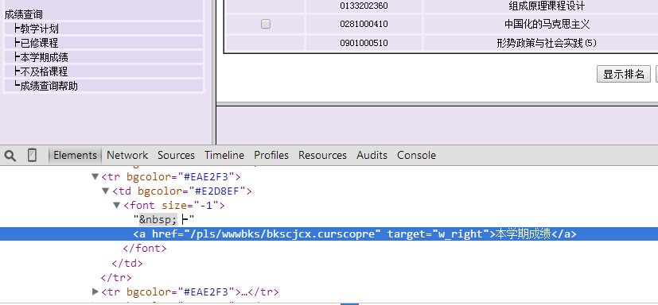
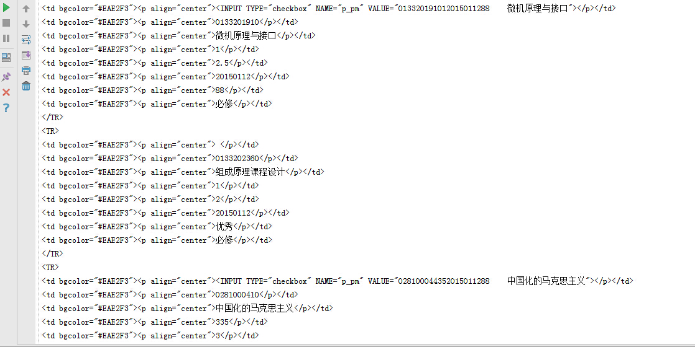

# 计算大学本学期绩点  
  
大家好，本次为大家带来的项目是计算大学本学期绩点。首先说明的是，博主来自山东大学，有属于个人的学生成绩管理系统，需要学号密码才可以登录，不过可能广大读者没有这个学号密码，不能实际进行操作，所以最主要的还是获取它的原理。最主要的是了解cookie的相关操作。

**本篇目标**

1. 模拟登录学生成绩管理系统

2. 抓取本学期成绩界面
 
3. 计算打印本学期成绩

## URL 的获取

恩，博主来自山东大学~

先贴一个 URL，让大家知道我们学校学生信息系统的网站构架，主页是 [http://jwxt.sdu.edu.cn:7890/zhxt_bks/zhxt_bks.html](http://jwxt.sdu.edu.cn:7890/zhxt_bks/zhxt_bks.html)，山东大学学生个人信息系统，进去之后，Oh 不，他竟然用了frame，一个多么古老的而又任性的写法，真是惊出一身冷汗~

算了，就算他是frame又能拿我怎么样？我们点到登录界面，审查一下元素，先看看登录界面的URL 是怎样的？



恩，看到了右侧的 frame 名称，src=”xk\_login.html”，可以分析出完整的登录界面的网址为 [http://jwxt.sdu.edu.cn:7890/zhxt_bks/xk_login.html](http://jwxt.sdu.edu.cn:7890/zhxt_bks/xk_login.html)，点进去看看，真是棒棒哒，他喵的竟然是清华大学**选课**系统，醉了，你说你抄袭就抄袭吧，改改名字也不错啊~

算了，就不和他计较了。现在，我们登录一下，用浏览器监听网络。

我用的是猎豹浏览器，审查元素时会有一个网络的选项，如果大家用的 Chrome，也有相对应的功能，Firefox 需要装插件 HttpFox，同样可以实现。

这个网络监听功能可以监听表单的传送以及请求头，响应头等等的信息。截个图看一下，恩，我偷偷把密码隐藏了，你看不到~

大家看到的是登录之后出现的信息以及 NetWork 监听，显示了 hearders 的详细信息。  



最主要的内容，我们可以发现有一个表单提交的过程，提交方式为 POST，两个参数分别为 stuid 和 pwd。

请求的URL为 [http://jwxt.sdu.edu.cn:7890/pls/wwwbks/bks_login2.login](http://jwxt.sdu.edu.cn:7890/pls/wwwbks/bks_login2.login)，没错，找到表单数据和目标地址就是这么简单。

在这里注意，刚才的 [http://jwxt.sdu.edu.cn:7890/zhxt_bks/xk_login.html](http://jwxt.sdu.edu.cn:7890/zhxt_bks/xk_login.html) 只是登录界面的地址，刚刚得到的这个地址才是登录索要提交到的真正的URL。希望大家这里不要混淆。

不知道山大这个系统有没有做headers的检查，我们先不管这么多，先尝试一下模拟登录并保存Cookie。

## 模拟登录

好，通过以上信息，我们已经找到了登录的目标地址为 [http://jwxt.sdu.edu.cn:7890/pls/wwwbks/bks_login2.login](http://jwxt.sdu.edu.cn:7890/pls/wwwbks/bks_login2.login)

有一个表单提交到这个URL，表单的两个内容分别为 stuid 和 pwd，学号和密码，没有其他的隐藏信息，提交方式为 POST。

好，现在我们首先构造以下代码来完成登录。看看会不会获取到登录之后的提示页面。

```
__author__ = 'CQC'
\# -*- coding:utf-8 -*-
 
import urllib
import urllib2
import cookielib
import re
 
\#山东大学绩点运算
class SDU:
 
    def __init__(self):
        self.loginUrl = 'http://jwxt.sdu.edu.cn:7890/pls/wwwbks/bks_login2.login'
        self.cookies = cookielib.CookieJar()
        self.postdata = urllib.urlencode({
            'stuid':'201200131012',
            'pwd':'xxxxxx'
         })
        self.opener = urllib2.build_opener(urllib2.HTTPCookieProcessor(self.cookies))
 
    def getPage(self):
        request  = urllib2.Request(
            url = self.loginUrl,
            data = self.postdata)
        result = self.opener.open(request)
        #打印登录内容
        print result.read().decode('gbk')
 
 
sdu = SDU()
sdu.getPage()  
```  

测试一下，竟然成功了，山大这网竟然没有做 headers 检查，很顺利就登录进去了。

说明一下，在这里我们利用了前面所说的 cookie，用到了 CookieJar 这个对象来保存cookies，另外通过构建 opener，利用 open 方法实现了登录。如果大家觉得这里有疑惑，请看 [Python爬虫入门六之Cookie的使用](http://cuiqingcai.com/968.html)，这篇文章说得比较详细。

好，我们看一下运行结果



酸爽啊，接下来我们只要再获取到本学期成绩界面然后把成绩抓取出来就好了。

## 抓取本学期成绩

让我们先在浏览器中找到本学期成绩界面，点击左边的本学期成绩。



重新审查元素，你会发现这个 frame 的 src 还是没有变，仍然是 xk\_login.html，引起这个页面变化的原因是在左边的本学期成绩这个超链接设置了一个目标 frame，所以，那个页面就显示在右侧了。

所以，让我们再审查一下本学期成绩这个超链接的内容是什么~  



恩，找到它了，<a href=”/pls/wwwbks/bkscjcx.curscopre” target=”w_right”>本学期成绩</a>

那么，完整的URL就是 [http://jwxt.sdu.edu.cn:7890/pls/wwwbks/bkscjcx.curscopre](http://jwxt.sdu.edu.cn:7890/pls/wwwbks/bkscjcx.curscopre)，好，URL已经找到了，我们继续完善一下代码，获取这个页面。

```
__author__ = 'CQC'
\# -*- coding:utf-8 -*-
 
import urllib
import urllib2
import cookielib
import re
 
\#山东大学绩点运算
class SDU:
 
    def __init__(self):
        \#登录URL
        self.loginUrl = 'http://jwxt.sdu.edu.cn:7890/pls/wwwbks/bks_login2.login'
        \#本学期成绩URL
        self.gradeUrl = 'http://jwxt.sdu.edu.cn:7890/pls/wwwbks/bkscjcx.curscopre'
        self.cookies = cookielib.CookieJar()
        self.postdata = urllib.urlencode({
            'stuid':'201200131012',
            'pwd':'xxxxxx'
         })
        \#构建opener
        self.opener = urllib2.build_opener(urllib2.HTTPCookieProcessor(self.cookies))
 
    \#获取本学期成绩页面
    def getPage(self):
        request  = urllib2.Request(
            url = self.loginUrl,
            data = self.postdata)
        result = self.opener.open(request)
        result = self.opener.open(self.gradeUrl)
        \#打印登录内容
        print result.read().decode('gbk')
 
 
sdu = SDU()
sdu.getPage()  
```  

上面的代码，我们最主要的是增加了

```
result = self.opener.open(self.gradeUrl)  
```  

这句代码，用原来的 opener 访问一个本学期成绩的 URL 即可。运行结果如下



恩，本学期成绩的页面已经被我们抓取下来了，接下来用正则表达式提取一下，然后计算学分即可

## 抓取有效信息

接下来我们就把页面内容提取一下，最主要的便是学分以及分数了。

平均绩点 = ∑（每科学分*每科分数）/总学分

所以我们把每科的学分以及分数抓取下来就好了，对于有些课打了良好或者优秀等级的，我们不进行抓取。

我们可以发现每一科都是TR标签，然后是一系列的td标签

```
<TR>
<td bgcolor="#EAE2F3"><p align="center"><INPUT TYPE="checkbox" NAME="p_pm" VALUE="013320131012015011294 面向对象技术"></p></td>
<td bgcolor="#EAE2F3"><p align="center">0133201310</p></td>
<td bgcolor="#EAE2F3"><p align="center">面向对象技术</p></td>
<td bgcolor="#EAE2F3"><p align="center">1</p></td>
<td bgcolor="#EAE2F3"><p align="center">2.5</p></td>
<td bgcolor="#EAE2F3"><p align="center">20150112</p></td>
<td bgcolor="#EAE2F3"><p align="center">94</p></td>
<td bgcolor="#EAE2F3"><p align="center">必修</p></td>
</TR>  
``` 
我们用下面的正则表达式进行提取即可，部分代码如下

```
page = self.getPage()
myItems = re.findall('<TR>.*?<p.*?<p.*?<p.*?<p.*?<p.*?>(.*?)</p>.*?<p.*?<p.*?>(.*?)</p>.*?</TR>',page,re.S) 
for item in myItems:
   self.credit.append(item[0].encode('gbk'))
   self.grades.append(item[1].encode('gbk'))  
```  

主要利用了 findall 方法，这个方法在此就不多介绍了，前面我们已经用过多次了。

得到的学分和分数我们都用列表 list 进行存储，所以用了 append 方法，每获取到一个信息就把它加进去。

## 整理计算最后绩点

恩，像上面那样把学分绩点都保存到列表 list 中了，所以我们最后用一个公式来计算学分绩点就好了，最后整理后的代码如下：
  
```  
\# -*- coding: utf-8 -*-  
 
import urllib
import urllib2
import cookielib
import re
import string
 
\#绩点运算
class SDU:
   
   \#类的初始化
   def __init__(self):
      \#登录URL
      self.loginUrl = 'http://jwxt.sdu.edu.cn:7890/pls/wwwbks/bks_login2.login'
      \#成绩URL
      self.gradeUrl = 'http://jwxt.sdu.edu.cn:7890/pls/wwwbks/bkscjcx.curscopre'
      \#CookieJar对象
      self.cookies = cookielib.CookieJar()
      \#表单数据
      self.postdata = urllib.urlencode({
            'stuid':'201200131012',
            'pwd':'xxxxx'
         })
      \#构建opener
      self.opener = urllib2.build_opener(urllib2.HTTPCookieProcessor(self.cookies))
      \#学分list
      self.credit = []
      \#成绩list
      self.grades = []
      
   def getPage(self):
      req  = urllib2.Request(
            url = self.loginUrl,
            data = self.postdata)
      result = self.opener.open(req)
      result = self.opener.open(self.gradeUrl)
      \#返回本学期成绩页面
      return result.read().decode('gbk')
   
   def getGrades(self):
      \#获得本学期成绩页面
      page = self.getPage()
      \#正则匹配
      myItems = re.findall('<TR>.*?<p.*?<p.*?<p.*?<p.*?<p.*?>(.*?)</p>.*?<p.*?<p.*?>(.*?)</p>.*?</TR>',page,re.S) 
      for item in myItems:
         self.credit.append(item[0].encode('gbk'))
         self.grades.append(item[1].encode('gbk'))
      self.getGrade()
      
   def getGrade(self):
      \#计算总绩点
      sum = 0.0
      weight = 0.0
      for i in range(len(self.credit)):
         if(self.grades[i].isdigit()):
            sum += string.atof(self.credit[i])*string.atof(self.grades[i])
            weight += string.atof(self.credit[i])
      
      print u"本学期绩点为:",sum/weight
      
sdu = SDU()
sdu.getGrades()  
```  

好，最后就会打印输出本学期绩点是多少，小伙伴们最主要的了解上面的编程思路就好。

最主要的内容就是 Cookie 的使用，模拟登录的功能。

本文思路参考来源：[汪海的爬虫](http://blog.csdn.net/pleasecallmewhy/article/details/9305229)