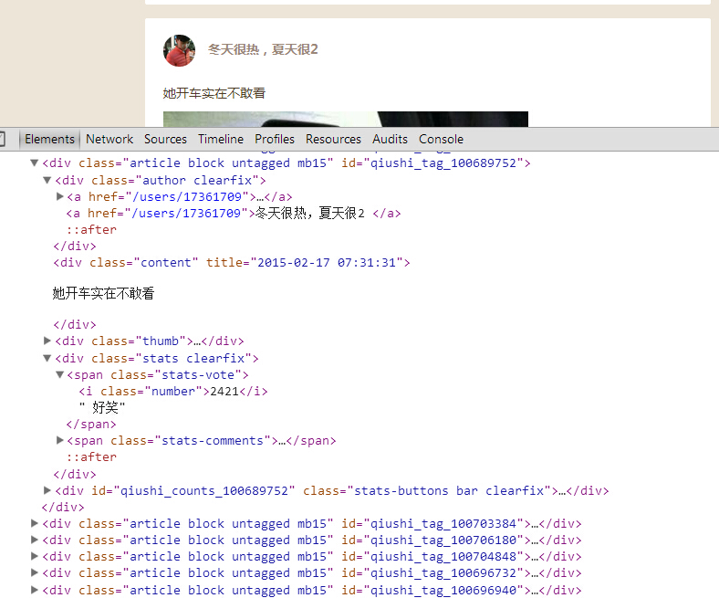
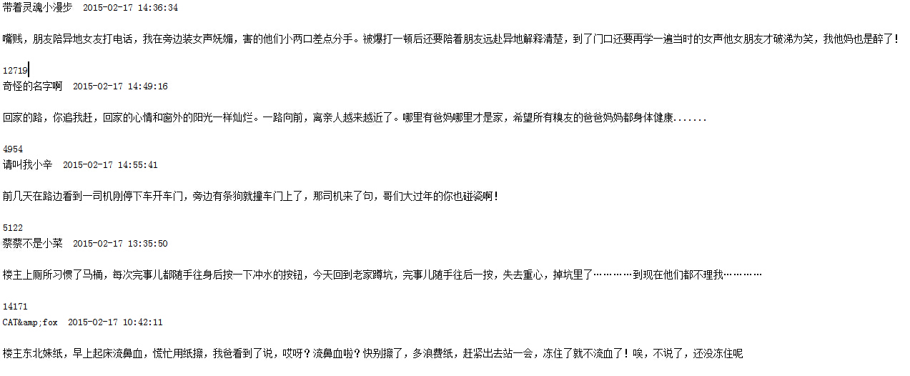

# 爬取糗事百科段子  
  
大家好，前面入门已经说了那么多基础知识了，下面我们做几个实战项目来挑战一下吧。那么这次为大家带来，Python 爬取糗事百科的小段子的例子。

首先，糗事百科大家都听说过吧？糗友们发的搞笑的段子一抓一大把，这次我们尝试一下用爬虫把他们抓取下来。

本篇目标

>1. 抓取糗事百科热门段子
2. 过滤带有图片的段子
3. 实现每按一次回车显示一个段子的发布时间，发布人，段子内容，点赞数。  

糗事百科是不需要登录的，所以也没必要用到 Cookie，另外糗事百科有的段子是附图的，我们把图抓下来图片不便于显示，那么我们就尝试过滤掉有图的段子吧。

好，现在我们尝试抓取一下糗事百科的热门段子吧，每按下一次回车我们显示一个段子。

## 确定 URL 并抓取页面代码

首先我们确定好页面的 URL 是 http://www.qiushibaike.com/hot/page/1，其中最后一个数字1代表页数，我们可以传入不同的值来获得某一页的段子内容。

我们初步构建如下的代码来打印页面代码内容试试看，先构造最基本的页面抓取方式，看看会不会成功

```
\# -*- coding:utf-8 -*-
import urllib
import urllib2
 
 
page = 1
url = 'http://www.qiushibaike.com/hot/page/' + str(page)
try:
    request = urllib2.Request(url)
    response = urllib2.urlopen(request)
    print response.read()
except urllib2.URLError, e:
    if hasattr(e,"code"):
        print e.code
    if hasattr(e,"reason"):
        print e.reason  
```  

运行程序，哦不，它竟然报错了，真是时运不济，命途多舛啊


```
line 373, in _read_status
 raise BadStatusLine(line)
httplib.BadStatusLine: ''  
```  

好吧，应该是 headers 验证的问题，我们加上一个 headers 验证试试看吧，将代码修改如下

```
\# -*- coding:utf-8 -*-
import urllib
import urllib2
 
page = 1
url = 'http://www.qiushibaike.com/hot/page/' + str(page)
user_agent = 'Mozilla/4.0 (compatible; MSIE 5.5; Windows NT)'
headers = { 'User-Agent' : user_agent }
try:
    request = urllib2.Request(url,headers = headers)
    response = urllib2.urlopen(request)
    print response.read()
except urllib2.URLError, e:
    if hasattr(e,"code"):
        print e.code
    if hasattr(e,"reason"):
        print e.reason  
```  

嘿嘿，这次运行终于正常了，打印出了第一页的 HTML 代码，大家可以运行下代码试试看。在这里运行结果太长就不贴了。

## 提取某一页的所有段子

好，获取了 HTML 代码之后，我们开始分析怎样获取某一页的所有段子。

首先我们审查元素看一下，按浏览器的 F12，截图如下


  
我们可以看到，每一个段子都是 <div class=”article block untagged mb15″ id=”…”>…</div> 包裹的内容。

现在我们想获取发布人，发布日期，段子内容，以及点赞的个数。不过另外注意的是，段子有些是带图片的，如果我们想在控制台显示图片是不现实的，所以我们直接把带有图片的段子给它剔除掉，只保存仅含文本的段子。

所以我们加入如下正则表达式来匹配一下，用到的方法是 re.findall 是找寻所有匹配的内容。方法的用法详情可以看前面说的正则表达式的介绍。

好，我们的正则表达式匹配语句书写如下，在原来的基础上追加如下代码


````
content = response.read().decode('utf-8')
pattern = re.compile('<div.*?class="author.*?>.*?<a.*?</a>.*?<a.*?>(.*?)</a>.*?<div.*?class'+
                     '="content".*?title="(.*?)">(.*?)</div>(.*?)<div class="stats.*?class="number">(.*?)</i>',re.S)
items = re.findall(pattern,content)
for item in items:
    print item[0],item[1],item[2],item[3],item[4]  
```  

现在正则表达式在这里稍作说明


1. .*? 是一个固定的搭配，.和*代表可以匹配任意无限多个字符，加上？表示使用非贪婪模式进行匹配，也就是我们会尽可能短地做匹配，以后我们还会大量用到 .*? 的搭配。

2. (.*?)代表一个分组，在这个正则表达式中我们匹配了五个分组，在后面的遍历item中，item[0]就代表第一个(.*?)所指代的内容，item[1]就代表第二个(.*?)所指代的内容，以此类推。

3. re.S 标志代表在匹配时为点任意匹配模式，点 . 也可以代表换行符。

现在我们可以看一下部分运行结果

>儒雅男神 2015-02-17 14:34:42
小时候一个一个拆着放的举个爪…  
<\div class=”thumb”>  
<a href=”/article/100705418?list=hot&s=4747301″ target=”_blank”   onclick=”_hmt.push([‘_trackEvent’, ‘post’, ‘click’, ‘signlePost’])”>

</a>   
</div>
7093  
奇怪的名字啊 2015-02-17 14:49:16  
回家的路，你追我赶，回家的心情和窗外的阳光一样灿烂。一路向前，离亲人越来越近了。哪里有爸妈哪里才是家，希望所有糗友的爸爸妈妈都身体健康…….  
4803  

这是其中的两个段子，分别打印了发布人，发布时间，发布内容，附加图片以及点赞数。

其中，附加图片的内容我把图片代码整体抠了出来，这个对应 item[3]，所以我们只需要进一步判断 item[3]里面是否含有img这个字样就可以进行过滤了。

好，我们再把上述代码中的 for 循环改为下面的样子


```
for item in items:
        haveImg = re.search("img",item[3])
        if not haveImg:
            print item[0],item[1],item[2],item[4]  
```  

现在，整体的代码如下

```
\# -*- coding:utf-8 -*-
import urllib
import urllib2
import re
 
page = 1
url = 'http://www.qiushibaike.com/hot/page/' + str(page)
user_agent = 'Mozilla/4.0 (compatible; MSIE 5.5; Windows NT)'
headers = { 'User-Agent' : user_agent }
try:
    request = urllib2.Request(url,headers = headers)
    response = urllib2.urlopen(request)
    content = response.read().decode('utf-8')
    pattern = re.compile('<div.*?class="author.*?>.*?<a.*?</a>.*?<a.*?>(.*?)</a>.*?<div.*?class'+
                         '="content".*?title="(.*?)">(.*?)</div>(.*?)<div class="stats.*?class="number">(.*?)</i>',re.S)
    items = re.findall(pattern,content)
    for item in items:
        haveImg = re.search("img",item[3])
        if not haveImg:
            print item[0],item[1],item[2],item[4]
except urllib2.URLError, e:
    if hasattr(e,"code"):
        print e.code
    if hasattr(e,"reason"):
        print e.reason  
```  

运行一下看下效果



恩，带有图片的段子已经被剔除啦。是不是很开森？

## 完善交互，设计面向对象模式

好啦，现在最核心的部分我们已经完成啦，剩下的就是修一下边边角角的东西，我们想达到的目的是：

按下回车，读取一个段子，显示出段子的发布人，发布日期，内容以及点赞个数。

另外我们需要设计面向对象模式，引入类和方法，将代码做一下优化和封装，最后，我们的代码如下所示

```
__author__ = 'CQC'
\# -*- coding:utf-8 -*-
import urllib
import urllib2
import re
import thread
import time
 
\#糗事百科爬虫类
class QSBK:
 
    \#初始化方法，定义一些变量
    def __init__(self):
        self.pageIndex = 1
        self.user_agent = 'Mozilla/4.0 (compatible; MSIE 5.5; Windows NT)'
        \#初始化headers
        self.headers = { 'User-Agent' : self.user_agent }
        \#存放段子的变量，每一个元素是每一页的段子们
        self.stories = []
        \#存放程序是否继续运行的变量
        self.enable = False
    \#传入某一页的索引获得页面代码
    def getPage(self,pageIndex):
        try:
            url = 'http://www.qiushibaike.com/hot/page/' + str(pageIndex)
            \#构建请求的request
            request = urllib2.Request(url,headers = self.headers)
            \#利用urlopen获取页面代码
            response = urllib2.urlopen(request)
            \#将页面转化为UTF-8编码
            pageCode = response.read().decode('utf-8')
            return pageCode
 
        except urllib2.URLError, e:
            if hasattr(e,"reason"):
                print u"连接糗事百科失败,错误原因",e.reason
                return None
 
 
    \#传入某一页代码，返回本页不带图片的段子列表
    def getPageItems(self,pageIndex):
        pageCode = self.getPage(pageIndex)
        if not pageCode:
            print "页面加载失败...."
            return None
        pattern = re.compile('<div.*?class="author.*?>.*?<a.*?</a>.*?<a.*?>(.*?)</a>.*?<div.*?class'+
                         '="content".*?title="(.*?)">(.*?)</div>(.*?)<div class="stats.*?class="number">(.*?)</i>',re.S)
        items = re.findall(pattern,pageCode)
        \#用来存储每页的段子们
        pageStories = []
        \#遍历正则表达式匹配的信息
        for item in items:
            \#是否含有图片
            haveImg = re.search("img",item[3])
            \#如果不含有图片，把它加入list中
            if not haveImg:
                \#item[0]是一个段子的发布者，item[1]是发布时间,item[2]是内容，item[4]是点赞数
                pageStories.append([item[0].strip(),item[1].strip(),item[2].strip(),item[4].strip()])
        return pageStories
 
    \#加载并提取页面的内容，加入到列表中
    def loadPage(self):
        \#如果当前未看的页数少于2页，则加载新一页
        if self.enable == True:
            if len(self.stories) < 2:
                \#获取新一页
                pageStories = self.getPageItems(self.pageIndex)
                \#将该页的段子存放到全局list中
                if pageStories:
                    self.stories.append(pageStories)
                    \#获取完之后页码索引加一，表示下次读取下一页
                    self.pageIndex += 1
    
    \#调用该方法，每次敲回车打印输出一个段子
    def getOneStory(self,pageStories,page):
        \#遍历一页的段子
        for story in pageStories:
            \#等待用户输入
            input = raw_input()
            \#每当输入回车一次，判断一下是否要加载新页面
            self.loadPage()
            \#如果输入Q则程序结束
            if input == "Q":
                self.enable = False
                return
            print u"第%d页\t发布人:%s\t发布时间:%s\n%s\n赞:%s\n" %(page,story[0],story[1],story[2],story[3])
    
    \#开始方法
    def start(self):
        print u"正在读取糗事百科,按回车查看新段子，Q退出"
        \#使变量为True，程序可以正常运行
        self.enable = True
        \#先加载一页内容
        self.loadPage()
        \#局部变量，控制当前读到了第几页
        nowPage = 0
        while self.enable:
            if len(self.stories)>0:
                \#从全局list中获取一页的段子
                pageStories = self.stories[0]
                \#当前读到的页数加一
                nowPage += 1
                \#将全局list中第一个元素删除，因为已经取出
                del self.stories[0]
                \#输出该页的段子
                self.getOneStory(pageStories,nowPage)
 
 
spider = QSBK()
spider.start()  
```  

好啦，大家来测试一下吧，点一下回车会输出一个段子，包括发布人，发布时间，段子内容以及点赞数，是不是感觉爽爆了！