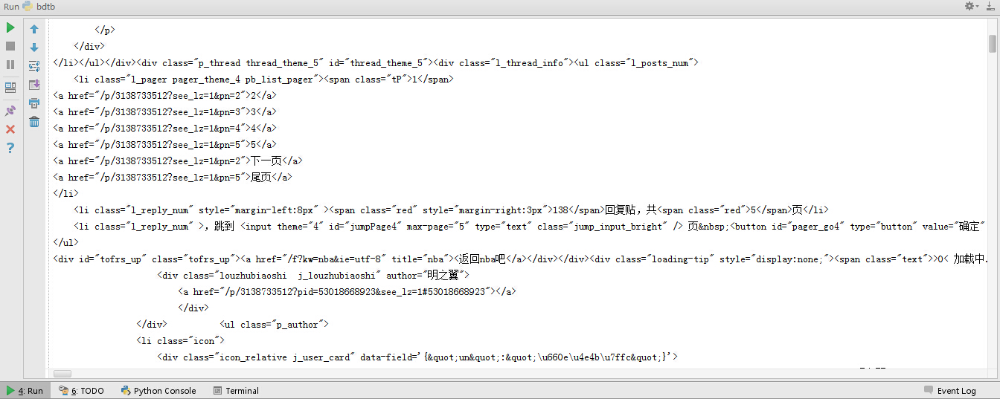
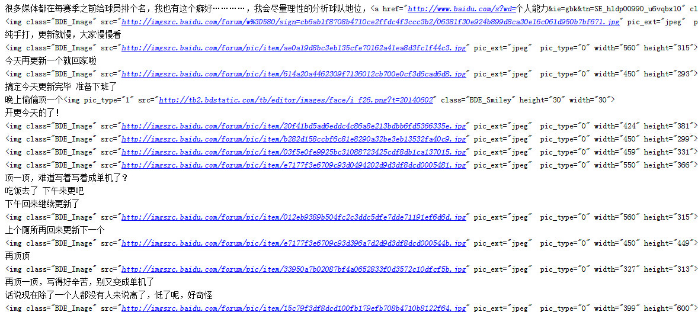
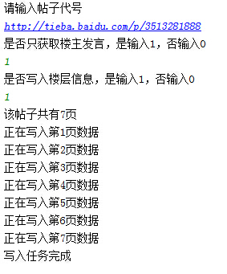

# 爬取百度贴吧帖子  
  
大家好，上次我们实验了爬取了糗事百科的段子，那么这次我们来尝试一下爬取百度贴吧的帖子。与上一篇不同的是，这次我们需要用到文件的相关操作。

**本篇目标**

1. 对百度贴吧的任意帖子进行抓取

2. 指定是否只抓取楼主发帖内容

3. 将抓取到的内容分析并保存到文件

## URL 格式的确定

首先，我们先观察一下百度贴吧的任意一个帖子。

比如：[http://tieba.baidu.com/p/3138733512?see_lz=1&pn=1](http://tieba.baidu.com/p/3138733512?see_lz=1&pn=1)，这是一个关于 NBA50 大的盘点，分析一下这个地址。

```
 http://  代表资源传输使用http协议
 tieba.baidu.com 是百度的二级域名，指向百度贴吧的服务器。
 /p/3138733512 是服务器某个资源，即这个帖子的地址定位符
 see_lz和pn是该URL的两个参数，分别代表了只看楼主和帖子页码，等于1表示该条件为真  
```  

所以我们可以把 URL 分为两部分，一部分为基础部分，一部分为参数部分。

例如，上面的URL我们划分基础部分是 [http://tieba.baidu.com/p/3138733512](http://tieba.baidu.com/p/3138733512)，参数部分是 ?see_lz=1&pn=1

## 页面的抓取

熟悉了 URL 的格式，那就让我们用 urllib2 库来试着抓取页面内容吧。上一篇糗事百科我们最后改成了面向对象的编码方式，这次我们直接尝试一下，定义一个类名叫 BDTB(百度贴吧)，一个初始化方法，一个获取页面的方法。

其中，有些帖子我们想指定给程序是否要只看楼主，所以我们把只看楼主的参数初始化放在类的初始化上，即 init 方法。另外，获取页面的方法我们需要知道一个参数就是帖子页码，所以这个参数的指定我们放在该方法中。

综上，我们初步构建出基础代码如下：

```
\_\_author\_\_ = 'CQC'
\# -*- coding:utf-8 -*-
import urllib
import urllib2
import re
 
\#百度贴吧爬虫类
class BDTB:
 
    \#初始化，传入基地址，是否只看楼主的参数
    def __init__(self,baseUrl,seeLZ):
        self.baseURL = baseUrl
        self.seeLZ = '?see_lz='+str(seeLZ)
 
    \#传入页码，获取该页帖子的代码
    def getPage(self,pageNum):
        try:
            url = self.baseURL+ self.seeLZ + '&pn=' + str(pageNum)
            request = urllib2.Request(url)
            response = urllib2.urlopen(request)
            print response.read()
            return response
        except urllib2.URLError, e:
            if hasattr(e,"reason"):
                print u"连接百度贴吧失败,错误原因",e.reason
                return None
 
baseURL = 'http://tieba.baidu.com/p/3138733512'
bdtb = BDTB(baseURL,1)
bdtb.getPage(1)  
```  

运行代码，我们可以看到屏幕上打印出了这个帖子第一页楼主发言的所有内容，形式为 HTML 代码。



## 提取相关信息

### 提取帖子标题  

首先，让我们提取帖子的标题。

在浏览器中审查元素，或者按 F12，查看页面源代码，我们找到标题所在的代码段，可以发现这个标题的 HTML 代码是

```
<h1 class="core_title_txt  " title="纯原创我心中的NBA2014-2015赛季现役50大" style="width: 396px">纯原创我心中的NBA2014-2015赛季现役50大</h1>  
```  

所以我们想提取 <h1> 标签中的内容，同时还要指定这个 class 确定唯一，因为 h1 标签实在太多啦。

正则表达式如下

```
<h1 class="core_title_txt.*?>(.*?)</h1>  
```  

所以，我们增加一个获取页面标题的方法

```
\#获取帖子标题
def getTitle(self):
    page = self.getPage(1)
    pattern = re.compile('<h1 class="core_title_txt.*?>(.*?)</h1>',re.S)
    result = re.search(pattern,page)
    if result:
        #print result.group(1)  #测试输出
        return result.group(1).strip()
    else:
        return None  
```  

### 提取帖子页数  

同样地，帖子总页数我们也可以通过分析页面中的共?页来获取。所以我们的获取总页数的方法如下

```
\#获取帖子一共有多少页
def getPageNum(self):
    page = self.getPage(1)
    pattern = re.compile('<li class="l_reply_num.*?</span>.*?<span.*?>(.*?)</span>',re.S)
    result = re.search(pattern,page)
    if result:
        #print result.group(1)  #测试输出
        return result.group(1).strip()
    else:
        return None  
```  

### 提取正文内容  

审查元素，我们可以看到百度贴吧每一层楼的主要内容都在 <div id=”post_content_xxxx”></div> 标签里面，所以我们可以写如下的正则表达式

```
<div id="post_content_.*?>(.*?)</div>  
```  

相应地，获取页面所有楼层数据的方法可以写成如下方法

```
\#获取每一层楼的内容,传入页面内容
def getContent(self,page):
    pattern = re.compile('<div id="post_content_.*?>(.*?)</div>',re.S)
    items = re.findall(pattern,page)
    for item in items:
        print item  
```  

好，我们运行一下结果看一下



真是醉了，还有一大片换行符和图片符，好口怕！既然这样，我们就要对这些文本进行处理，把各种各样复杂的标签给它剔除掉，还原精华内容，把文本处理写成一个方法也可以，不过为了实现更好的代码架构和代码重用，我们可以考虑把标签等的处理写作一个类。

那我们就叫它 Tool（工具类吧），里面定义了一个方法，叫 replace，是替换各种标签的。在类中定义了几个正则表达式，主要利用了 re.sub 方法对文本进行匹配后然后替换。具体的思路已经写到注释中，大家可以看一下这个类

```
import re
 
\#处理页面标签类
class Tool:
    \#去除img标签,7位长空格
    removeImg = re.compile('| {7}|')
    \#删除超链接标签
    removeAddr = re.compile('<a.*?>|</a>')
    \#把换行的标签换为\n
    replaceLine = re.compile('<tr>|<div>|</div>|</p>')
    \#将表格制表<td>替换为\t
    replaceTD= re.compile('<td>')
    \#把段落开头换为\n加空两格
    replacePara = re.compile('<p.*?>')
    \#将换行符或双换行符替换为\n
    replaceBR = re.compile('<br><br>|<br>')
    \#将其余标签剔除
    removeExtraTag = re.compile('<.*?>')
    def replace(self,x):
        x = re.sub(self.removeImg,"",x)
        x = re.sub(self.removeAddr,"",x)
        x = re.sub(self.replaceLine,"\n",x)
        x = re.sub(self.replaceTD,"\t",x)
        x = re.sub(self.replacePara,"\n    ",x)
        x = re.sub(self.replaceBR,"\n",x)
        x = re.sub(self.removeExtraTag,"",x)
        \#strip()将前后多余内容删除
        return x.strip()  
```  

在使用时，我们只需要初始化一下这个类，然后调用 replace 方法即可。

现在整体代码是如下这样子的，现在我的代码是写到这样子的

```
__author__ = 'CQC'
\# -*- coding:utf-8 -*-
import urllib
import urllib2
import re
 
\#处理页面标签类
class Tool:
    \#去除img标签,7位长空格
    removeImg = re.compile('| {7}|')
    \#删除超链接标签
    removeAddr = re.compile('<a.*?>|</a>')
    \#把换行的标签换为\n
    replaceLine = re.compile('<tr>|<div>|</div>|</p>')
    \#将表格制表<td>替换为\t
    replaceTD= re.compile('<td>')
    \#把段落开头换为\n加空两格
    replacePara = re.compile('<p.*?>')
    \#将换行符或双换行符替换为\n
    replaceBR = re.compile('<br><br>|<br>')
    \#将其余标签剔除
    removeExtraTag = re.compile('<.*?>')
    def replace(self,x):
        x = re.sub(self.removeImg,"",x)
        x = re.sub(self.removeAddr,"",x)
        x = re.sub(self.replaceLine,"\n",x)
        x = re.sub(self.replaceTD,"\t",x)
        x = re.sub(self.replacePara,"\n    ",x)
        x = re.sub(self.replaceBR,"\n",x)
        x = re.sub(self.removeExtraTag,"",x)
        \#strip()将前后多余内容删除
        return x.strip()
 
 
\#百度贴吧爬虫类
class BDTB:
 
    \#初始化，传入基地址，是否只看楼主的参数
    def __init__(self,baseUrl,seeLZ):
        self.baseURL = baseUrl
        self.seeLZ = '?see_lz='+str(seeLZ)
        self.tool = Tool()
    \#传入页码，获取该页帖子的代码
    def getPage(self,pageNum):
        try:
            url = self.baseURL+ self.seeLZ + '&pn=' + str(pageNum)
            request = urllib2.Request(url)
            response = urllib2.urlopen(request)
            return response.read().decode('utf-8')
        except urllib2.URLError, e:
            if hasattr(e,"reason"):
                print u"连接百度贴吧失败,错误原因",e.reason
                return None
 
    \#获取帖子标题
    def getTitle(self):
        page = self.getPage(1)
        pattern = re.compile('<h1 class="core_title_txt.*?>(.*?)</h1>',re.S)
        result = re.search(pattern,page)
        if result:
            #print result.group(1)  #测试输出
            return result.group(1).strip()
        else:
            return None
 
    \#获取帖子一共有多少页
    def getPageNum(self):
        page = self.getPage(1)
        pattern = re.compile('<li class="l_reply_num.*?</span>.*?<span.*?>(.*?)</span>',re.S)
        result = re.search(pattern,page)
        if result:
            #print result.group(1)  #测试输出
            return result.group(1).strip()
        else:
            return None
 
    \#获取每一层楼的内容,传入页面内容
    def getContent(self,page):
        pattern = re.compile('<div id="post_content_.*?>(.*?)</div>',re.S)
        items = re.findall(pattern,page)
        #for item in items:
        #  print item
        print self.tool.replace(items[1])
        
 
baseURL = 'http://tieba.baidu.com/p/3138733512'
bdtb = BDTB(baseURL,1)
bdtb.getContent(bdtb.getPage(1))  
```  

我们尝试一下，重新再看一下效果，这下经过处理之后应该就没问题了，是不是感觉好酸爽！


### 替换楼层  

至于这个问题，我感觉直接提取楼层没什么必要呀，因为只看楼主的话，有些楼层的编号是间隔的，所以我们得到的楼层序号是不连续的，这样我们保存下来也没什么用。

所以可以尝试下面的方法：

>1. 每打印输出一段楼层，写入一行横线来间隔，或者换行符也好。
2. 试着重新编一个楼层，按照顺序，设置一个变量，每打印出一个结果变量加一，打印出这个变量当做楼层。  
3. 
这里我们尝试一下吧，看看效果怎样

把 getContent 方法修改如下

````
\#获取每一层楼的内容,传入页面内容
def getContent(self,page):
    pattern = re.compile('<div id="post_content_.*?>(.*?)</div>',re.S)
    items = re.findall(pattern,page)
    floor = 1
    for item in items:
        print floor,u"楼------------------------------------------------------------------------------------------------------------------------------------\n"
        print self.tool.replace(item)
        floor += 1  
```  

运行一下看看效果


嘿嘿，效果还不错吧，感觉真酸爽！接下来我们完善一下，然后写入文件

## 写入文件

最后便是写入文件的过程，过程很简单，就几句话的代码而已，主要是利用了以下两句
  
```
file = open(“tb.txt”,”w”)
file.writelines(obj)  
```  

这里不再赘述，稍后直接贴上完善之后的代码。

## 完善代码

现在我们对代码进行优化，重构，在一些地方添加必要的打印信息，整理如下

```
__author__ = 'CQC'
\# -*- coding:utf-8 -*-
import urllib
import urllib2
import re
 
\#处理页面标签类
class Tool:
    \#去除img标签,7位长空格
    removeImg = re.compile('| {7}|')
    \#删除超链接标签
    removeAddr = re.compile('<a.*?>|</a>')
    \#把换行的标签换为\n
    replaceLine = re.compile('<tr>|<div>|</div>|</p>')
    \#将表格制表<td>替换为\t
    replaceTD= re.compile('<td>')
    \#把段落开头换为\n加空两格
    replacePara = re.compile('<p.*?>')
    \#将换行符或双换行符替换为\n
    replaceBR = re.compile('<br><br>|<br>')
    \#将其余标签剔除
    removeExtraTag = re.compile('<.*?>')
    def replace(self,x):
        x = re.sub(self.removeImg,"",x)
        x = re.sub(self.removeAddr,"",x)
        x = re.sub(self.replaceLine,"\n",x)
        x = re.sub(self.replaceTD,"\t",x)
        x = re.sub(self.replacePara,"\n    ",x)
        x = re.sub(self.replaceBR,"\n",x)
        x = re.sub(self.removeExtraTag,"",x)
        \#strip()将前后多余内容删除
        return x.strip()
 
 
\#百度贴吧爬虫类
class BDTB:
 
    #初始化，传入基地址，是否只看楼主的参数
    def __init__(self,baseUrl,seeLZ,floorTag):
        \#base链接地址
        self.baseURL = baseUrl
        \#是否只看楼主
        self.seeLZ = '?see_lz='+str(seeLZ)
        \#HTML标签剔除工具类对象
        self.tool = Tool()
        \#全局file变量，文件写入操作对象
        self.file = None
        \#楼层标号，初始为1
        self.floor = 1
        \#默认的标题，如果没有成功获取到标题的话则会用这个标题
        self.defaultTitle = u"百度贴吧"
        \#是否写入楼分隔符的标记
        self.floorTag = floorTag
 
    \#传入页码，获取该页帖子的代码
    def getPage(self,pageNum):
        try:
            \#构建URL
            url = self.baseURL+ self.seeLZ + '&pn=' + str(pageNum)
            request = urllib2.Request(url)
            response = urllib2.urlopen(request)
            \#返回UTF-8格式编码内容
            return response.read().decode('utf-8')
        \#无法连接，报错
        except urllib2.URLError, e:
            if hasattr(e,"reason"):
                print u"连接百度贴吧失败,错误原因",e.reason
                return None
 
    \#获取帖子标题
    def getTitle(self,page):
        \#得到标题的正则表达式
        pattern = re.compile('<h1 class="core_title_txt.*?>(.*?)</h1>',re.S)
        result = re.search(pattern,page)
        if result:
            \#如果存在，则返回标题
            return result.group(1).strip()
        else:
            return None
 
    \#获取帖子一共有多少页
    def getPageNum(self,page):
        \#获取帖子页数的正则表达式
        pattern = re.compile('<li class="l_reply_num.*?</span>.*?<span.*?>(.*?)</span>',re.S)
        result = re.search(pattern,page)
        if result:
            return result.group(1).strip()
        else:
            return None
 
    \#获取每一层楼的内容,传入页面内容
    def getContent(self,page):
        \#匹配所有楼层的内容
        pattern = re.compile('<div id="post_content_.*?>(.*?)</div>',re.S)
        items = re.findall(pattern,page)
        contents = []
        for item in items:
            \#将文本进行去除标签处理，同时在前后加入换行符
            content = "\n"+self.tool.replace(item)+"\n"
            contents.append(content.encode('utf-8'))
        return contents
 
    def setFileTitle(self,title):
        \#如果标题不是为None，即成功获取到标题
        if title is not None:
            self.file = open(title + ".txt","w+")
        else:
            self.file = open(self.defaultTitle + ".txt","w+")
 
    def writeData(self,contents):
        \#向文件写入每一楼的信息
        for item in contents:
            if self.floorTag == '1':
                \#楼之间的分隔符
                floorLine = "\n" + str(self.floor) + u"-----------------------------------------------------------------------------------------\n"
                self.file.write(floorLine)
            self.file.write(item)
            self.floor += 1
 
    def start(self):
        indexPage = self.getPage(1)
        pageNum = self.getPageNum(indexPage)
        title = self.getTitle(indexPage)
        self.setFileTitle(title)
        if pageNum == None:
            print "URL已失效，请重试"
            return
        try:
            print "该帖子共有" + str(pageNum) + "页"
            for i in range(1,int(pageNum)+1):
                print "正在写入第" + str(i) + "页数据"
                page = self.getPage(i)
                contents = self.getContent(page)
                self.writeData(contents)
        \#出现写入异常
        except IOError,e:
            print "写入异常，原因" + e.message
        finally:
            print "写入任务完成"
 
 
 
print u"请输入帖子代号"
baseURL = 'http://tieba.baidu.com/p/' + str(raw_input(u'http://tieba.baidu.com/p/'))
seeLZ = raw_input("是否只获取楼主发言，是输入1，否输入0\n")
floorTag = raw_input("是否写入楼层信息，是输入1，否输入0\n")
bdtb = BDTB(baseURL,seeLZ,floorTag)
bdtb.start()  
```  

现在程序演示如下



 
完成之后，可以查看一下当前目录下多了一个以该帖子**命名**的 txt 文件，内容便是帖子的所有数据。

抓贴吧，就是这么简单和任性！