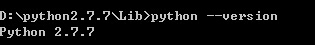
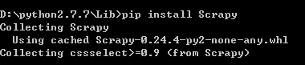
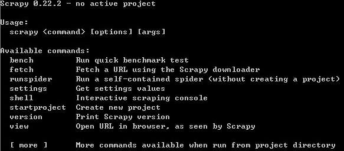
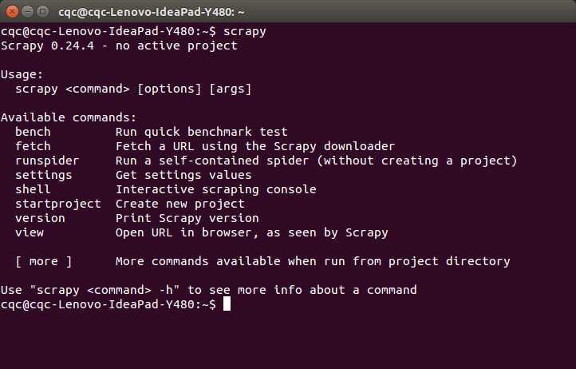

# 爬虫框架 Scrapy 安装配置  
  
初级的爬虫我们利用 urllib 和 urllib2 库以及正则表达式就可以完成了，不过还有更加强大的工具，爬虫框架 Scrapy，这安装过程也是煞费苦心哪，在此整理如下。

## Windows 平台： ##

我的系统是 Win7，首先，你要有 Python，我用的是2.7.7版本，Python3 相仿，只是一些源文件不同。

官网文档：[http://doc.scrapy.org/en/latest/intro/install.html](http://doc.scrapy.org/en/latest/intro/install.html)，最权威哒，下面是我的亲身体验过程。

### 安装 Python

安装过程我就不多说啦，我的电脑中已经安装了 Python 2.7.7 版本啦，安装完之后记得配置环境变量，比如我的安装在 D 盘，D:\python2.7.7，就把以下两个路径添加到 Path 变量中

```
D:\python2.7.7;D:\python2.7.7\Scripts   
```   

配置好了之后，在命令行中输入 python –version，如果没有提示错误，则安装成功  



### 安装 pywin32

在 windows下，必须安装 pywin32，安装地址：[http://sourceforge.net/projects/pywin32/](http://sourceforge.net/projects/pywin32/)

下载对应版本的 pywin32，直接双击安装即可，安装完毕之后验证：  


在 **python** 命令行下输入

import win32com

如果没有提示错误，则证明安装成功

### 安装 pip

pip是用来安装其他必要包的**工具**，首先下载 [get-pip.py](https://bootstrap.pypa.io/get-pip.py)

下载好之后，选中该文件所在路径，执行下面的命令

```
python get-pip.py    
```  

执行命令后便会安装好 pip，并且同时，它帮你安装了 [setuptools](https://pypi.python.org/pypi/setuptools)

安装完了之后在命令行中执行

```
pip --version  
```  

如果提示如下，说明就安装成功了，如果提示不是内部或外部命令，那么就检查一下**环境变量**有没有配置好吧，有两个路径。


### 安装 pyOPENSSL

在 Windows下，是没有预装 pyOPENSSL 的，而在 Linux 下是已经安装好的。

安装地址：[https://launchpad.net/pyopenssl](https://launchpad.net/pyopenssl)

### 安装 xml
 
lxml 的详细介绍 [点我](http://lxml.de/) ，是一种使用 Python 编写的库，可以迅速、灵活地处理 XML

直接执行如下命令

```
pip install lxml   
```  

就可完成安装，如果提示 Microsoft Visual C++ 库没安装，则 [点我](http://www.microsoft.com/en-us/download/details.aspx?id=44266) 下载支持的库。

### 安装 Scrapy

最后就是激动人心的时刻啦，上面的铺垫做好了，我们终于可以享受到胜利的果实啦！

执行如下命令

```
pip install Scrapy  
```  


pip 会另外下载其他依赖的包，这些就不要我们手动安装啦，等待一会，大功告成！

### 验证安装

输入 Scrapy

如果提示如下命令，就证明安装成功啦，如果失败了，请检查上述步骤有何疏漏。



## Linux Ubuntu 平台： ##

Linux 下安装非常简单，只需要执行几条命令几个

### 安装 Python

```
sudo apt-get install python2.7 python2.7-dev  
```  

### 安装 pip

首先下载 [get-pip.py](https://bootstrap.pypa.io/get-pip.py)

下载好之后，选中该文件所在[路径](http://www.baidu.com/s?ie=utf-8&wd=路径&tn=35091180_cpr&rsv_lu=233&fenlei=mv6qUZNxTZn0IZRqIHD4PHbsnWc0T1YdujRvmhm3n199n1--mWb10AGo5yfvuWuBP1R4PhDYmWT1Pjm0IAYqnWm3P1D3P16s0APh5Hc1nsKzmWYs0AkdpvbqP6KWUMw85HndnjbknH6sgvPsT6K1TL0qnfK1TL0z5HD0IgF_5y9YIZ0-nYD-nbm-nbuWIy-kpy4Mmv7GFHF7mvqVFHFArHDzFHF7pZwVU00)，执行下面的命令

```
sudo python get-pip.py  
```  

### 直接安装 Scrapy

由于 Linux下已经预装了 lxml 和 OPENSSL

如果想验证 lxml ，可以分别输入

```
sudo pip install lxml  
```  

出现下面的提示这证明已经安装成功

```
Requirement already satisfied (use --upgrade to upgrade): lxml in /usr/lib/python2.7/dist-packages  
```  

如果想验证 openssl，则直接输入 openssl 即可，如果跳转到 OPENSSL 命令行，则安装成功。

接下来直接安装 Scrapy 即可

```
sudo pip install Scrapy  
```  

安装完毕之后，输入 scrapy

注意，这里linux下不要输入 Scrapy，linux 依然严格区分大小写的，感谢 kamen 童鞋提醒。

如果出现如下提示，这证明安装成功
  
```
Usage:
 scrapy <command> [options] [args]
 
Available commands:
 bench Run quick benchmark test
 fetch Fetch a URL using the Scrapy downloader
 runspider Run a self-contained spider (without creating a project)
 settings Get settings values
 shell Interactive scraping console
 startproject Create new project
 version Print Scrapy version
 view Open URL in browser, as seen by Scrapy
 
 [ more ] More commands available when run from project directory  
```  

截图如下



如有问题，欢迎留言！祝各位小伙伴顺利安装！