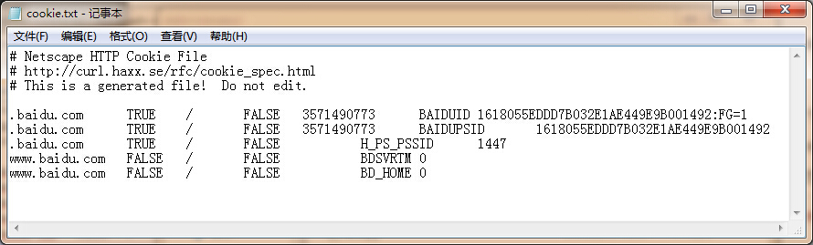

# Cookie 的使用  
  
大家好哈，上一节我们研究了一下爬虫的异常处理问题，那么接下来我们一起来看一下 Cookie 的使用。

为什么要使用 Cookie 呢？

Cookie，指某些网站为了辨别用户身份、进行 session 跟踪而储存在用户本地终端上的数据（通常经过加密）

比如说有些网站需要登录后才能访问某个页面，在登录之前，你想抓取某个页面内容是不允许的。那么我们可以利用 Urllib2 库保存我们登录的 Cookie，然后再抓取其他页面就达到目的了。

在此之前呢，我们必须先介绍一个 opener 的概念。

## Opener

当你获取一个 URL 你使用一个 opener(一个 urllib2.OpenerDirector 的实例)。在前面，我们都是使用的默认的 opener，也就是 urlopen。它是一个特殊的 opener，可以理解成opener 的一个特殊实例，传入的参数仅仅是 url，data，timeout。

如果我们需要用到 Cookie，只用这个 opener 是不能达到目的的，所以我们需要创建更一般的opener 来实现对 Cookie 的设置。

## Cookielib

cookielib 模块的主要作用是提供可存储 cookie 的对象，以便于与 urllib2 模块配合使用来访问 Internet 资源。Cookielib 模块非常强大，我们可以利用本模块的 CookieJar 类的对象来捕获 cookie 并在后续连接请求时重新发送，比如可以实现模拟登录功能。该模块主要的对象有 CookieJar、FileCookieJar、MozillaCookieJar、LWPCookieJar。

它们的关系：CookieJar —-派生—->FileCookieJar  —-派生—–>MozillaCookieJar 和LWPCookieJar
  
### 获取 Cookie 保存到变量  

首先，我们先利用 CookieJar 对象实现获取 cookie 的功能，存储到变量中，先来感受一下
 
```
import urllib2
import cookielib
\#声明一个CookieJar对象实例来保存cookie
cookie = cookielib.CookieJar()
\#利用urllib2库的HTTPCookieProcessor对象来创建cookie处理器
handler=urllib2.HTTPCookieProcessor(cookie)
\#通过handler来构建opener
opener = urllib2.build_opener(handler)
\#此处的open方法同urllib2的urlopen方法，也可以传入request
response = opener.open('http://www.baidu.com')
for item in cookie:
    print 'Name = '+item.name
    print 'Value = '+item.value  
```  

我们使用以上方法将 cookie 保存到变量中，然后打印出了 cookie 中的值，运行结果如下
  
```
Name = BAIDUID
Value = B07B663B645729F11F659C02AAE65B4C:FG=1
Name = BAIDUPSID
Value = B07B663B645729F11F659C02AAE65B4C
Name = H\_PS\_PSSID
Value = 12527\_11076\_1438\_10633
Name = BDSVRTM
Value = 0
Name = BD_HOME
Value = 0  
```   
 
###  保存 Cookie 到文件  

在上面的方法中，我们将 cookie 保存到了 cookie 这个变量中，如果我们想将 cookie 保存到文件中该怎么做呢？这时，我们就要用到

FileCookieJar 这个对象了，在这里我们使用它的子类 MozillaCookieJar 来实现 Cookie的保存

```
import cookielib
import urllib2
 
\#设置保存cookie的文件，同级目录下的cookie.txt
filename = 'cookie.txt'
\#声明一个MozillaCookieJar对象实例来保存cookie，之后写入文件
cookie = cookielib.MozillaCookieJar(filename)
\#利用urllib2库的HTTPCookieProcessor对象来创建cookie处理器
handler = urllib2.HTTPCookieProcessor(cookie)
\#通过handler来构建opener
opener = urllib2.build_opener(handler)
\#创建一个请求，原理同urllib2的urlopen
response = opener.open("http://www.baidu.com")
\#保存cookie到文件
cookie.save(ignore_discard=True, ignore_expires=True)  
```  

关于最后 save 方法的两个参数在此说明一下：

官方解释如下：

>ignore\_discard: save even cookies set to be discarded. 
ignore\_expires: save even cookies that have expiredThe file is overwritten if it already exists  

由此可见，ignore_discard 的意思是即使 cookies 将被丢弃也将它保存下来，ignore_expires 的意思是如果在该文件中 cookies 已经存在，则覆盖原文件写入，在这里，我们将这两个全部设置为 True。运行之后，cookies 将被保存到 cookie.txt文件中，我们查看一下内容，附图如下

  
  
### 从文件中获取 Cookie 并访问  

那么我们已经做到把 Cookie 保存到文件中了，如果以后想使用，可以利用下面的方法来读取cookie 并访问网站，感受一下

```
import cookielib
import urllib2
 
\#创建MozillaCookieJar实例对象
cookie = cookielib.MozillaCookieJar()
\#从文件中读取cookie内容到变量
cookie.load('cookie.txt', ignore_discard=True, ignore_expires=True)
\#创建请求的request
req = urllib2.Request("http://www.baidu.com")
\#利用urllib2的build_opener方法创建一个opener
opener = urllib2.build_opener(urllib2.HTTPCookieProcessor(cookie))
response = opener.open(req)
print response.read()  
```  

设想，如果我们的 cookie.txt 文件中保存的是某个人登录百度的 cookie，那么我们提取出这个 cookie 文件内容，就可以用以上方法模拟这个人的账号登录百度。

### 利用 cookie 模拟网站登录  

下面我们以我们学校的教育系统为例，利用 cookie 实现模拟登录，并将 cookie 信息保存到文本文件中，来感受一下 cookie 大法吧！

注意：密码我改了啊，别偷偷登录本宫的选课系统 o(╯□╰)o
  
```
import urllib
import urllib2
import cookielib
 
filename = 'cookie.txt'
\#声明一个MozillaCookieJar对象实例来保存cookie，之后写入文件
cookie = cookielib.MozillaCookieJar(filename)
opener = urllib2.build_opener(urllib2.HTTPCookieProcessor(cookie))
postdata = urllib.urlencode({
            'stuid':'201200131012',
            'pwd':'23342321'
        })
\#登录教务系统的URL
loginUrl = 'http://jwxt.sdu.edu.cn:7890/pls/wwwbks/bks\_login2.login'
\#模拟登录，并把cookie保存到变量
result = opener.open(loginUrl,postdata)
\#保存cookie到cookie.txt中
cookie.save(ignore\_discard=True, ignore\_expires=True)
\#利用cookie请求访问另一个网址，此网址是成绩查询网址
gradeUrl = 'http://jwxt.sdu.edu.cn:7890/pls/wwwbks/bkscjcx.curscopre'
\#请求访问成绩查询网址
result = opener.open(gradeUrl)
print result.read()  
```  

以上程序的原理如下

创建一个带有 cookie 的 opener，在访问登录的 URL 时，将登录后的 cookie 保存下来，然后利用这个 cookie 来访问其他网址。

如登录之后才能查看的**成绩**查询呀，本学期课表呀等等网址，模拟登录就这么实现啦，是不是很酷炫？

好，小伙伴们要加油哦！我们现在可以顺利获取网站信息了，接下来就是把网站里面有效内容提取出来，下一节我们去会会正则表达式！