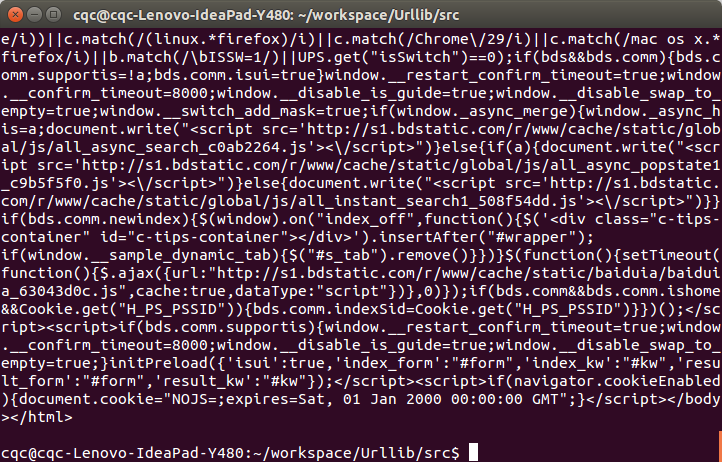

# Urllib 库的基本使用  
  
## 分分钟扒一个网页下来

怎样扒网页呢？其实就是根据URL来获取它的网页信息，虽然我们在浏览器中看到的是一幅幅优美的画面，但是其实是由浏览器解释才呈现出来的，实质它是一段 HTML 代码，加 JS、CSS，如果把网页比作一个人，那么 HTML 便是他的骨架，JS 便是他的肌肉，CSS 便是它的衣服。所以最重要的部分是存在于 HTML 中的，下面我们就写个例子来扒一个网页下来。

```
import urllib2  
response = urllib2.urlopen("http://www.baidu.com")
print response.read()
```  

是的你没看错，真正的程序就两行，把它保存成 demo.py，进入该文件的目录，执行如下命令查看运行结果，感受一下。
  
```
python demo.py
```  


看，这个网页的**源码**已经被我们扒下来了，是不是很酸爽？

## 分析扒网页的方法

那么我们来分析这两行代码，第一行
  
```
response = urllib2.urlopen("http://www.baidu.com")  
```  

首先我们调用的是 urllib2 库里面的 urlopen 方法，传入一个 URL，这个网址是百度首页，协议是 HTTP 协议，当然你也可以把 HTTP 换做 FTP,FILE,HTTPS 等等，只是代表了一种**访问控制**协议，urlopen 一般接受三个参数，它的参数如下：

```
urlopen(url, data, timeout)   
```  

第一个参数 url 即为 URL，第二个参数 data 是访问 URL 时要传送的数据，第三个 timeout是设置超时时间。

第二三个参数是可以不传送的，data 默认为空 None，timeout 默认为 socket.\_GLOBAL\_DEFAULT\_TIMEOUT

第一个参数 URL 是必须要传送的，在这个例子里面我们传送了百度的 URL，执行 urlopen 方法之后，返回一个 response 对象，返回信息便保存在这里面。

```
print response.read()  
```  

response 对象有一个 read 方法，可以返回获取到的网页内容。

如果不加 read 直接打印会是什么？答案如下：

```
<addinfourl at 139728495260376 whose fp = <socket._fileobject object at 0x7f1513fb3ad0>>  
```  

直接打印出了该对象的描述，所以记得一定要加 read 方法，否则它不出来内容可就不怪我咯！

## 构造 Requset

其实上面的 urlopen 参数可以传入一个 request 请求,它其实就是一个 Request 类的实例，构造时需要传入 Url,Data 等等的内容。比如上面的两行代码，我们可以这么改写

```
import urllib2
request = urllib2.Request("http://www.baidu.com")
response = urllib2.urlopen(request)
print response.read()  
```  

运行结果是完全一样的，只不过中间多了一个 request 对象，推荐大家这么写，因为在构建请求时还需要加入好多内容，通过构建一个 request，**服务器**响应请求得到应答，这样显得**逻辑**上清晰明确。

## POST 和 GET 数据传送

上面的程序演示了最基本的网页抓取，不过，现在大多数网站都是动态网页，需要你动态地传递参数给它，它做出对应的响应。所以，在访问时，我们需要传递数据给它。最常见的情况是什么？对了，就是登录注册的时候呀。

把数据用户名和密码传送到一个 URL，然后你得到服务器处理之后的响应，这个该怎么办？下面让我来为小伙伴们揭晓吧！

数据传送分为 POST 和 GET 两种方式，两种方式有什么区别呢？

最重要的区别是 GET 方式是直接以链接形式访问，链接中包含了所有的参数，当然如果包含了密码的话是一种不安全的选择，不过你可以直观地看到自己提交了什么内容。POST 则不会在网址上显示所有的参数，不过如果你想直接查看提交了什么就不太方便了，大家可以酌情选择。

POST 方式：  

上面我们说了 data 参数是干嘛的？对了，它就是用在这里的，我们传送的数据就是这个参数data，下面演示一下 POST 方式。

```
import urllib
import urllib2
values = {"username":"1016903103@qq.com","password":"XXXX"}
data = urllib.urlencode(values) 
url = "https://passport.csdn.net/account/login?from=http://my.csdn.net/my/mycsdn"
request = urllib2.Request(url,data)
response = urllib2.urlopen(request)
print response.read()  
```  

我们引入了 urllib 库，现在我们模拟登陆 CSDN，当然上述代码可能登陆不进去，因为还要做一些设置头部 header 的工作，或者还有一些参数没有设置全，还没有提及到在此就不写上去了，在此只是说明登录的原理。我们需要定义一个字典，名字为 values，参数我设置了 username 和 password，下面利用 urllib 的 urlencode 方法将字典编码，命名为 data，构建 request 时传入两个参数，url 和 data，运行程序，即可实现登陆，返回的便是登陆后呈现的页面内容。当然你可以自己搭建一个**服务器**来测试一下。

注意上面字典的定义方式还有一种，下面的写法是等价的

```
import urllib
import urllib2
values = {}
values['username'] = "1016903103@qq.com"
values['password'] = "XXXX"
data = urllib.urlencode(values) 
url = "http://passport.csdn.net/account/login?from=http://my.csdn.net/my/mycsdn"
request = urllib2.Request(url,data)
response = urllib2.urlopen(request)
print response.read()  
```  

以上方法便实现了 POST 方式的传送

GET 方式：  

至于 GET 方式我们可以直接把参数写到网址上面，直接构建一个带参数的 URL 出来即可。

```
import urllib
import urllib2
values = {}
values['username'] = "1016903103@qq.com"
values['password'] = "XXXX"
data = urllib.urlencode(values) 
url = "http://passport.csdn.net/account/login?from=http://my.csdn.net/my/mycsdn"
request = urllib2.Request(url,data)
response = urllib2.urlopen(request)
print response.read()  
```  

你可以 print geturl，打印输出一下 url，发现其实就是原来的 url 加？然后加编码后的参数

```
http://passport.csdn.net/account/login?username=1016903103%40qq.com&password=XXXX   
```  

和我们平常 GET 访问方式一模一样，这样就实现了数据的 GET 方式传送。